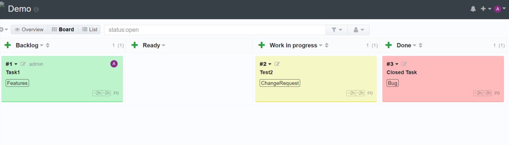
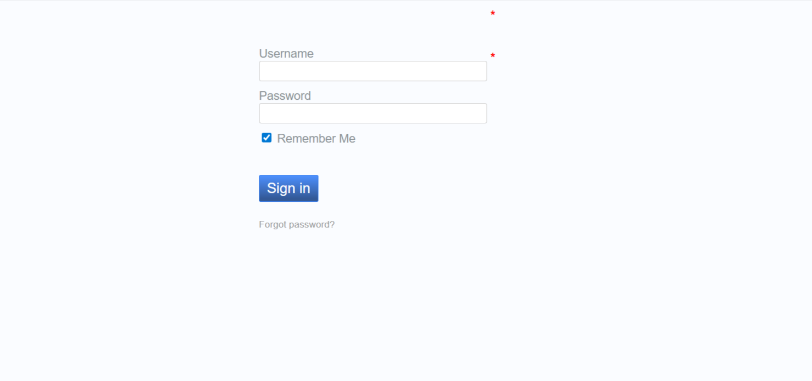
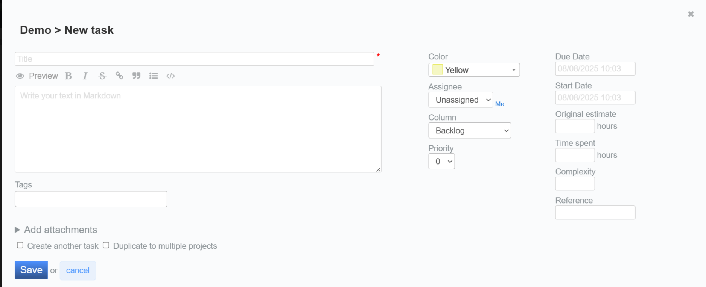

# Kanboard – Customized Version

_A customized version of [Kanboard](https://kanboard.org/) with plugins, API integrations, and UI enhancements for improved project management._






---

## 📌 Overview

This repository contains my customized implementation of the open-source **Kanboard** project management tool.  
It includes:

- UI improvements for a better user experience
- New plugins for task automation
- API integrations with external systems
- Optimized workflow for agile teams

This project is part of my **portfolio** to showcase my skills in open-source customization, PHP development, and project management tool integration.

---

## 🚀 Features

- **Custom Plugins** to extend Kanboard’s core functionality
- **Enhanced Dashboard** with improved navigation
- **API Integration** using Kanboard JSON-RPC
- **Responsive UI Tweaks** for better mobile usability
- **Automated Task Movement** between columns

---

## 🛠 Tech Stack

- **Backend:** PHP 8+, MySQL/MariaDB
- **Frontend:** HTML, CSS, JavaScript
- **Other Tools:** Docker (optional), Composer, Apache/Nginx

---

## 📂 Project Structure

```
Kanboard/
│── app/             # Core Kanboard application
│── plugins/         # Custom plugins
│── docs/            # Screenshots and documentation
│── assets/          # Static assets (CSS, JS, images)
│── config.php       # Configuration (no sensitive info included)
│── README.md        # This documentation
```

---

## ⚙️ Installation

1. Clone the repository:
   ```bash
   git clone https://github.com/priyadhurai/Kanboard.git
   ```
2. Move into the project directory:
   ```bash
   cd Kanboard
   ```
3. Set up the database & configuration:
   - Create a MySQL database
   - Update `config.php` with your database details
4. Run in browser:
   - Place files inside your web server root (`htdocs` or `www`)
   - Access via `http://localhost/kanboard`

---

## 📸 Screenshots

| Dashboard View                   | Task Board               |
| -------------------------------- | ------------------------ |
|  |  |

---

## 📡 API Integration Example

Here’s how tasks can be moved automatically via the Kanboard JSON-RPC API:

```php
$client = new JsonRPC\Client('http://localhost/jsonrpc.php');
$client->authentication('jsonrpc', 'API_KEY');

$client->moveTaskPosition(1, 5, 2, 1); // project_id, task_id, column_id, position
```

---

## 📜 License

This project is released under the **MIT License** – see [LICENSE](LICENSE) for details.

---

## 🙌 Acknowledgements

- [Kanboard](https://kanboard.org/) – Original open-source project
- [Kanboard API Docs](https://docs.kanboard.org/en/latest/api/jsonrpc.html)
- Community contributors
